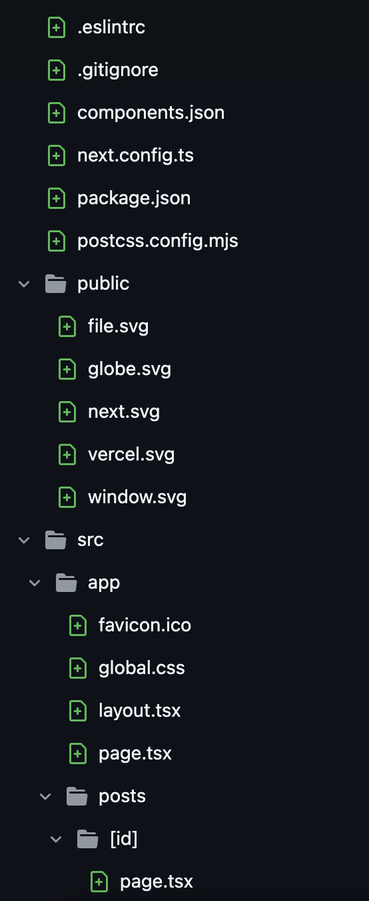

# Blog App

> 🧠 Одностраничный блог, созданный с использованием Next.js 15 (App Router), Redux, TypeScript, Tailwind и валидации через ZOD.

---

## 🌍 Language | Мова | Язык

- [🇬🇧 English ](./../ua/README.MD)
- [🇺🇦 Українська](./../ua/README.MD)
- [русский](./README.MD)

---
### 🧾 Описание
Одностраничный блог с использованием Redux, TypeScript, SSR 13 и ZOD валидации.

### ⚙️ Основа приложения
Построен на стандартном приложении Next.js (режим App Router, `/src`, ESLint, Tailwind)  
**Версия Next.js**: `15.2.4`

### 🛠 Особенности
- ESLint конфигурация: **Airbnb стиль**
- `.eslintrc` включает:
    - TypeScript парсер
    - Airbnb базу + hooks
    - Кастомные правила:
        - разрешён `console.log`
        - отключен `prefer-default-export`
        - поддержка `.tsx`
        - 
- ✅ Next.js 15 with App Router
- ✅ Redux
- ✅ TypeScript + ESLint (Airbnb style)
- ✅ ZOD Validation
- ✅ Tailwind CSS
- ✅ Firebase integration
- ✅ Dark/Light Theme support


## 📸 Скриншоты

> Вы можете посмотреть коммиты с UI-скриншотами ниже:



## [initial commit](https://github.com/rocolusso/kit-global-test-challenge/commit/d95b228debda8e20caac5d809f16e98869abcecf)

## [change component render method to ssr (page with posts)](https://github.com/rocolusso/kit-global-test-challenge/commit/d95b228debda8e20caac5d809f16e98869abcecf)

## [changed component render method to ssr (post page) / added PostControls component](https://github.com/rocolusso/kit-global-test-challenge/commit/d95b228debda8e20caac5d809f16e98869abcecf)

## [fixed issues with styles / removed inline styles and replace on Tailwind](https://github.com/rocolusso/kit-global-test-challenge/commit/f822e3bff86c74d4cb5b5e660304ee51015f1d64)

## [updated NavButton component](https://github.com/rocolusso/kit-global-test-challenge/commit/c2717dffac1d80360d3fb4ca47e03f5610f37a20)

## [rename btnComponent for easier understandig the logic of component functionality](https://github.com/rocolusso/kit-global-test-challenge/commit/ff13eb906b65e1fcd5316899a2c1d8fd3913910d)

## [added functionality for adding comment of post](https://github.com/rocolusso/kit-global-test-challenge/commit/2a4d2d31d1af725d9cd51cd535d02fa2418c6366)

## [added functionality for editing data of post](https://github.com/rocolusso/kit-global-test-challenge/commit/93d2ddab54370e5dca9859f899a7dc0dcb8e2229)


## [updated functionality for editing post/// added funcion for deleting post from database](https://github.com/rocolusso/kit-global-test-challenge/commit/e97256757a756f309552adef8eaf75bb65e64f45)

## [added state manager redux for switching app theme in dark/light mode](https://github.com/rocolusso/kit-global-test-challenge/commit/446f48818760aa48c4403c4586c6fe64b9e88062)


## 🛠 Режимы оформления

> В проекте используется эстетика дизайна Сильного минимализма, вдохновлённая стилем GitHub Trending. Интерфейс чистый, современный и простой.

---

## 🚀 Getting Started

```zsh
# 1. Установите зависимости
npm install
# or
yarn

# 2. Запустите в режиме разработки
npm run dev
# или
yarn dev

# 3. Сборка для продакшена
npm run build
# или
yarn build

# 4. Запуск продакшн-сервера
npm run start
# или
yarn start
